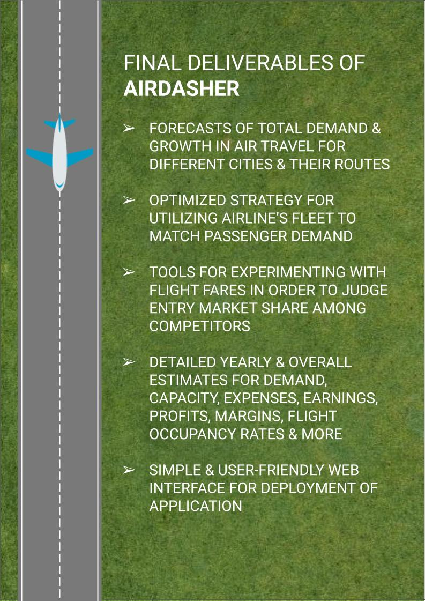

# AIRDASHER
## Analytical Intelligence for Route Development And Strategic Handling of Economic Resources

This is my submission for the <a href="https://www.hackerearth.com/challenges/hackathon/rolls-royce/">R² Data Labs Hackathon</a>.

## Website Available - http://airdasher.pythonanywhere.com/
## Demo Video - https://youtu.be/_wftrsszOh0
### Secondary GitHub repo - https://github.com/SakshatRao/R2_Data_Labs_Hackathon

### Brief

Rapidly developing economies, affordable flight pricings & post-pandemic revival of air traffic have provided airlines with an opportunity to capitalize on increasing demand for air travel. To make well-informed decisions about extending their network & introducing new flights, direct customer feedback is useful but difficult, time-consuming & expensive to collect. In such cases, city-wise macro-economic data could be a useful solution to forecast air travel demand in the long-term.

AIRDASHER is a proposal to tap in to the growing global aviation analytics market to assist airlines & airports with new route development strategies through AI-based solutions. The focus is mainly on Indian tier-I/II cities and APAC regions where growth in aviation analytics is expected to be maximum.

AIRDASHER firstly identifies cities/airports having high demand & growth in air travel and also suggests route to integrate such cities to an airline’s network. This is enabled through trained Machine Learning models to forecast air travel demand based on macro-economic factors. Finally AIRDASHER provides a comprehensive parameterized tool for cost & resource analysis of such routes to judge a route’s feasibility & profitability.

Along with the application of new route development, AIRDASHER can also provide analyses, statistics & insights for the overall Indian/APAC civil aviation sector.

The business model would primarily be to offer AIRDASHER as an end-to-end Route Development tool targeted towards airlines. In addition to this, AIRDASHER can also be targeted towards airports, regional governments & tourism boards for analyzing air travel demand trends and also to investigate needs for establishing new airports. AIRDASHER can also be targeted towards aircraft lessors & aircraft manufacturers/OEMs for providing insights about the Indian/APAC civil aviation sector to understand patterns in usage of different aircraft types for different flights and in different regions.

Some of the key success factors would include quick entry into the market for maximum capitalization of post-pandemic growth of air travel. Macro-economic factors could also be combined with direct customer feedback for best results in short & long term forecasting. And finally, expert knowledge in the domain of airline operations, costs, strategies & risks can immensely help improve the tool’s usability & the core business direction.